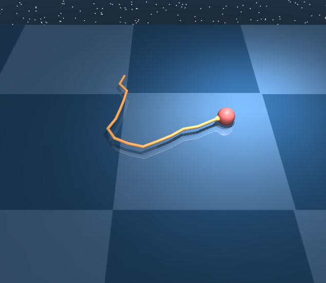
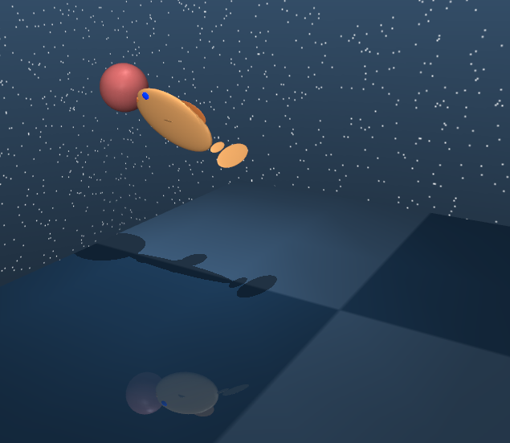
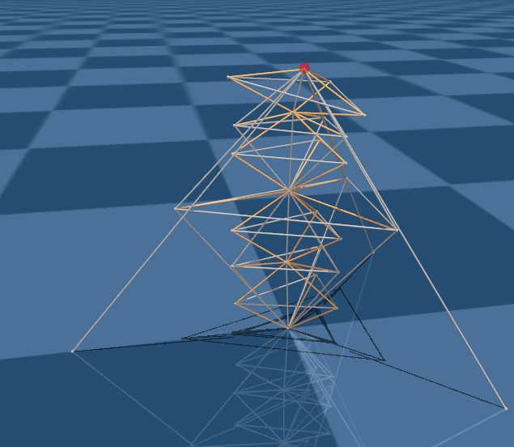

# pod2c_mujoco200
Partially-Observed Decoupled Data-based Control implementation on MuJoCo 200 Windows x64

------

The algorithm has three steps:
1. Find the openloop nominal control using gradient descent method.
2. Fit an arma model with input-output data for each timestep.
3. Design a linear feedback policy based on the time varying arma system as the closedloop policy.

Requirements
- Windows x64
- Matlab 2018 and later
- MuJoCo 200 Windows x64 version

Algorithm implementation
- The openloop search code is in `./software/sample/openloop.cpp`.
- The simulation and testing code is in `./software/sample/testioid.cpp`.
- `pod2c_arma_tensegrity.m` applies the algorithm to the tensegrity structures: dbar3d, t1d1_3d and t2d1_3d.
- `pod2c_arma_robot.m` applies the algorithm to the classic robotic models: pendulum, cartpole, 3-link swimmer, 6-link swimmer, 15-link swimmer and fish.

Results

